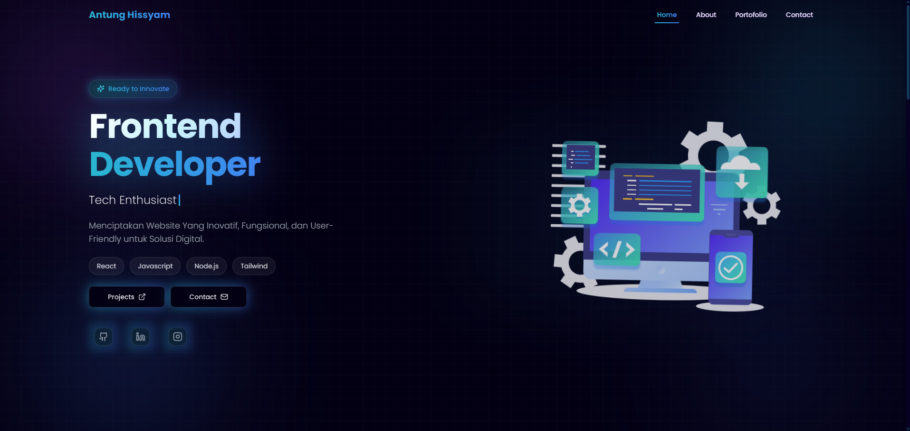

# Portofolio Antung Hissyam - Front-End Web Developer



<div align="center">

[](https://reactjs.org/)
[](https://vitejs.dev/)
[](https://tailwindcss.com/)
[](https://supabase.com/)
[](https://vercel.com/)

</div>

## 📄 Deskripsi

Ini adalah repositori kode sumber untuk **Website Portofolio Pribadi Antung Hissyam**. Website ini dirancang sebagai etalase digital untuk menampilkan proyek, sertifikat, dan perjalanan saya sebagai Mahasiswa Informatika dan Front-End Web Developer.

Dibangun dengan fokus pada desain antarmuka modern, responsif, dan performa tinggi, website ini menggunakan ekosistem React terbaru dengan Vite dan manajemen konten dinamis menggunakan Supabase.

🔗 **Live Demo:** [https://antung-hissyam.netlify.app/] 

## ✨ Fitur Utama

* **Modern & Responsif:** Desain adaptif yang terlihat memukau di perangkat mobile, tablet, dan desktop.
* **Welcome Screen Animasi:** Halaman pembuka dengan efek *typing* dan transisi halus.
* **Konten Dinamis:** Data Proyek dan Sertifikat diambil secara *real-time* dari **Supabase**.
* **Komentar Real-time:** Pengunjung dapat meninggalkan komentar yang tersimpan di database Supabase.
* **Formulir Kontak:** Integrasi email langsung menggunakan **FormSubmit** dengan notifikasi **SweetAlert2**.
* **Animasi Interaktif:** Menggunakan **AOS (Animate On Scroll)**, **Framer Motion**, dan **Lottie Files** untuk pengalaman pengguna yang menarik.
* **Background Animasi:** Latar belakang dengan efek *blobs* bergerak yang responsif terhadap scroll.

## 🛠️ Tech Stack

Proyek ini dibangun menggunakan teknologi dan library berikut:

### Core
* **[React](https://reactjs.org/):** Library JavaScript untuk membangun antarmuka pengguna.
* **[Vite](https://vitejs.dev/):** Build tool yang super cepat.
* **[React Router DOM](https://reactrouter.com/):** Untuk manajemen navigasi halaman.

### Styling & UI
* **[Tailwind CSS](https://tailwindcss.com/):** Framework CSS utility-first.
* **[Material UI (MUI)](https://mui.com/):** Komponen UI (digunakan untuk Tabs dan Modal Sertifikat).
* **[Lucide React](https://lucide.dev/):** Koleksi ikon yang ringan dan konsisten.

### Backend & Data
* **[Supabase](https://supabase.com/):** Backend-as-a-Service untuk database proyek, sertifikat, dan komentar.
* **[Axios](https://axios-http.com/):** HTTP client untuk request API.

### Animasi & Interaksi
* **[Framer Motion](https://www.framer.com/motion/):** Library animasi untuk React.
* **[AOS](https://michalsnik.github.io/aos/):** Animasi elemen saat di-scroll.
* **[Lottie React](https://lottiefiles.com/):** Menampilkan animasi JSON ringan.
* **[SweetAlert2](https://sweetalert2.github.io/):** Popup notifikasi yang cantik.

## 🚀 Cara Menjalankan Secara Lokal

Ikuti langkah-langkah ini untuk menjalankan proyek di komputer Anda:

1.  **Clone repositori**
    ```bash
    git clone [https://github.com/hissyam90/portofolio-antunghissyam.git](https://github.com/hissyam90/portofolio-antunghissyam.git)
    cd portofolio-antunghissyam
    ```

2.  **Install dependencies**
    Pastikan Anda sudah menginstall Node.js.
    ```bash
    npm install
    # atau
    yarn install
    ```

3.  **Konfigurasi Environment Variables**
    Buat file `.env` di root direktori proyek dan tambahkan kredensial Supabase Anda:
    ```env
    VITE_SUPABASE_URL=your_supabase_url_here
    VITE_SUPABASE_ANON_KEY=your_supabase_anon_key_here
    ```

4.  **Jalankan server development**
    ```bash
    npm run dev
    ```

5.  Buka browser dan akses `http://localhost:5173`.

---

## 👤 Penulis

**Antung Hissyam**

* Website: https://antung-hissyam.netlify.app/
* GitHub: https://github.com/hissyam90

---
*Terima kasih telah mengunjungi repositori ini! Jangan lupa berikan ⭐️ jika Anda menyukainya.*
